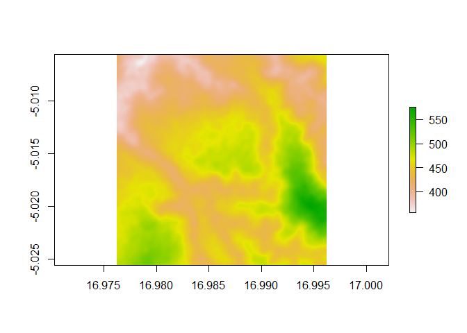
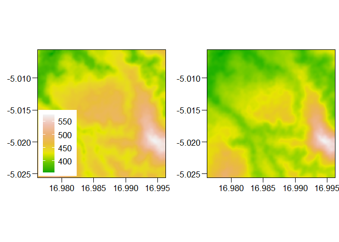
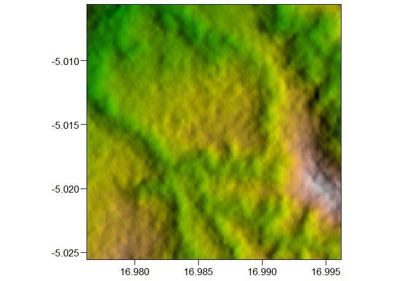

``` r
library(tidyverse)
```

    ## ── Attaching core tidyverse packages ──────────────────────── tidyverse 2.0.0 ──
    ## ✔ dplyr     1.1.4     ✔ readr     2.1.5
    ## ✔ forcats   1.0.0     ✔ stringr   1.5.1
    ## ✔ ggplot2   3.5.2     ✔ tibble    3.2.1
    ## ✔ lubridate 1.9.4     ✔ tidyr     1.3.1
    ## ✔ purrr     1.0.4     
    ## ── Conflicts ────────────────────────────────────────── tidyverse_conflicts() ──
    ## ✖ dplyr::filter() masks stats::filter()
    ## ✖ dplyr::lag()    masks stats::lag()
    ## ℹ Use the conflicted package (<http://conflicted.r-lib.org/>) to force all conflicts to become errors

The first step is to download the needed topographic data using the
`elevatr` pacakge. For that, I need to define a bounding box for my map.
As an example here, I am using the coordinates of the archaeological
site of Mukila, in the Kwango province of the Democratic Republic of the
Congo. If you want to know more about the site, than please check out
our paper here
<https://www.sciencedirect.com/science/article/pii/S0277379124002531>.

``` r
bbox <- data.frame(
  x = c(16.9862 - .01, 
        16.9862 + .01),
  y = c(-5.0156 - .01, 
        -5.0156 + .01))
```

Now I can download the SRMT background data:

``` r
dem <- elevatr::get_elev_raster(
  locations = bbox, 
  prj = "EPSG:4326", 
  z = 14, 
  clip = "bbox")
```

    ## Mosaicing & Projecting

    ## Clipping DEM to bbox

    ## Note: Elevation units are in meters.

The resulting raster can easily inspected using the `raster::plot()`
function:

``` r
raster::plot(dem)
```



In the next step, I create the hillshade by calculating the slope and
aspect for each raster cell using the `raster::terrain()` function. The
hillshade is calculated based on slope and aspect using the
`raster::hillshade()` function.

``` r
slope = raster::terrain(dem, opt = 'slope')
aspect = raster::terrain(dem, opt = 'aspect')
hill = raster::hillShade(slope, aspect, 40, 270)
```

Okay, now that we have all the necessary data, I convert them to
dataframes to be able to better work with them:

``` r
dem.df <- as(dem, "SpatialPixelsDataFrame")
dem.df <- as.data.frame(dem.df)
colnames(dem.df) <- c("value", "x", "y")

head(dem.df)
```

    ##      value        x       y
    ## 1 413.2669 16.97623 -5.0056
    ## 2 412.0410 16.97628 -5.0056
    ## 3 410.8152 16.97632 -5.0056
    ## 4 409.5662 16.97636 -5.0056
    ## 5 408.2519 16.97640 -5.0056
    ## 6 406.8912 16.97645 -5.0056

Now I need to get the color values for the choose color pallet. For
this, I use the `colourvalues` package:

``` r
dem.df.rgb <- cbind(
  dem.df,
  # hex values
  data.frame(
    hex = colourvalues::color_values(dem.df$value, "terrain")
  ),
  # rgb values
  colourvalues::color_values_rgb(
    dem.df$value, 
    "terrain", 
    include_alpha = F) %>% 
    as.data.frame() %>%
    dplyr::rename(
      R = V1, 
      G = V2, 
      B = V3) %>%
    dplyr::mutate(
      R = R / 255, 
      G = G / 255, 
      B = B / 255
    )
)
head(dem.df.rgb)
```

    ##      value        x       y       hex         R         G B
    ## 1 413.2669 16.97623 -5.0056 #67C700FF 0.4039216 0.7803922 0
    ## 2 412.0410 16.97628 -5.0056 #65C600FF 0.3960784 0.7764706 0
    ## 3 410.8152 16.97632 -5.0056 #62C500FF 0.3843137 0.7725490 0
    ## 4 409.5662 16.97636 -5.0056 #5FC500FF 0.3725490 0.7725490 0
    ## 5 408.2519 16.97640 -5.0056 #5DC400FF 0.3647059 0.7686275 0
    ## 6 406.8912 16.97645 -5.0056 #5AC300FF 0.3529412 0.7647059 0

At this stage it is important to devide the color values by 255.
Otherwise, the ‘multiplication’ later would not work.

``` r
cowplot::plot_grid(
  # version with terrain colors applied to values:
  ggplot() + 
    geom_tile(
      data = dem.df.rgb, 
      aes(x = x, y = y, fill = value)
    ) + 
    scale_fill_gradientn(colours = terrain.colors(7)) + 
    scale_x_continuous(
      expand = c(0, 0)) + 
    scale_y_continuous(
      expand = c(0, 0)) + 
    coord_equal() + 
    ggthemes::theme_base() + 
    theme(
      plot.background = element_rect(colour = NA),
      axis.title = element_blank(), 
      legend.position = c(.01, .01), 
      legend.justification = c(0, 0),
      legend.title = element_blank()
    ),
  # version with the hex color values from above
  ggplot() + 
    geom_tile(
      data = dem.df.rgb, 
      aes(x = x, y = y, fill = hex)
    ) + 
    scale_fill_identity() + 
    scale_x_continuous(
      expand = c(0, 0)) + 
    scale_y_continuous(
      expand = c(0, 0)) + 
    coord_equal() + 
    ggthemes::theme_base() + 
    theme(
      plot.background = element_rect(colour = NA),
      axis.title = element_blank()
    ),
  nrow = 1
)
```

    ## Warning: A numeric `legend.position` argument in `theme()` was deprecated in ggplot2
    ## 3.5.0.
    ## ℹ Please use the `legend.position.inside` argument of `theme()` instead.
    ## This warning is displayed once every 8 hours.
    ## Call `lifecycle::last_lifecycle_warnings()` to see where this warning was
    ## generated.



The `colourvalues` package seems to nicely represent the elevation,
although with a slightly different spread of the colors towards the min
and max.

But for this exercise, I go further and get RGB (greyscale) color values
for the hillshade. But first, I convert the raster to a dataframe:

``` r
hill.df <- as(hill, "SpatialPixelsDataFrame")
hill.df <- as.data.frame(hill.df)
colnames(hill.df) <- c("value", "x", "y")
head(hill.df)
```

    ##       value        x         y
    ## 1 0.4004007 16.97628 -5.005643
    ## 2 0.4011711 16.97632 -5.005643
    ## 3 0.3984833 16.97636 -5.005643
    ## 4 0.3942413 16.97640 -5.005643
    ## 5 0.3927668 16.97645 -5.005643
    ## 6 0.3944377 16.97649 -5.005643

Now for the RGB values, I chose a different approach, as I am only
dealing with a greyscales:

``` r
hill.df.rgb <- hill.df %>%
  dplyr::filter(!is.na(value)) %>%
  dplyr::mutate(
    R = (value - min(value)) / (max(value) - min(value)), # * 1.6 
    G = (value - min(value)) / (max(value) - min(value)), # * 1.6
    B = (value - min(value)) / (max(value) - min(value))) # * 1.6

hill.df.rgb$R[hill.df.rgb$R > 1] <- 1 
hill.df.rgb$G[hill.df.rgb$G > 1] <- 1 
hill.df.rgb$B[hill.df.rgb$B > 1] <- 1 

head(hill.df.rgb)
```

    ##       value        x         y         R         G         B
    ## 1 0.4004007 16.97628 -5.005643 0.4098678 0.4098678 0.4098678
    ## 2 0.4011711 16.97632 -5.005643 0.4106795 0.4106795 0.4106795
    ## 3 0.3984833 16.97636 -5.005643 0.4078479 0.4078479 0.4078479
    ## 4 0.3942413 16.97640 -5.005643 0.4033789 0.4033789 0.4033789
    ## 5 0.3927668 16.97645 -5.005643 0.4018256 0.4018256 0.4018256
    ## 6 0.3944377 16.97649 -5.005643 0.4035859 0.4035859 0.4035859

With `dem.df.rgb` and `hill.df.rgb`, we can simply multiply the values
for each cell and, in case a value goes beyong 255, cap the scale at 255
for each chanel.

``` r
dem.hill.rgb.df <- dem.df.rgb %>%
  dplyr::left_join(hill.df.rgb, by = c("x", "y")) %>%
  dplyr::mutate(R = R.x * R.y,
                G = G.x * G.y,
                B = B.x * B.y) %>%
  dplyr::filter(!is.na(R))

dem.hill.rgb.df$col <- rgb(
  dem.hill.rgb.df$R * 255, 
  dem.hill.rgb.df$G * 255, 
  dem.hill.rgb.df$B * 255, 
  maxColorValue = 255)

head(dem.hill.rgb.df)
```

    ##    value.x        x         y       hex       R.x       G.x B.x   value.y
    ## 1 413.0625 16.97628 -5.005643 #67C700FF 0.4039216 0.7803922   0 0.4004007
    ## 2 411.7119 16.97632 -5.005643 #64C600FF 0.3921569 0.7764706   0 0.4011711
    ## 3 410.3489 16.97636 -5.005643 #61C500FF 0.3803922 0.7725490   0 0.3984833
    ## 4 408.9508 16.97640 -5.005643 #5EC400FF 0.3686275 0.7686275   0 0.3942413
    ## 5 407.5278 16.97645 -5.005643 #5CC300FF 0.3607843 0.7647059   0 0.3927668
    ## 6 406.1049 16.97649 -5.005643 #58C300FF 0.3450980 0.7647059   0 0.3944377
    ##         R.y       G.y       B.y         R         G B     col
    ## 1 0.4098678 0.4098678 0.4098678 0.1655545 0.3198576 0 #2A5100
    ## 2 0.4106795 0.4106795 0.4106795 0.1610508 0.3188805 0 #295100
    ## 3 0.4078479 0.4078479 0.4078479 0.1551421 0.3150825 0 #275000
    ## 4 0.4033789 0.4033789 0.4033789 0.1486965 0.3100481 0 #254F00
    ## 5 0.4018256 0.4018256 0.4018256 0.1449724 0.3072784 0 #244E00
    ## 6 0.4035859 0.4035859 0.4035859 0.1392767 0.3086245 0 #234E00

``` r
ggplot() + 
  geom_tile(
    data = dem.hill.rgb.df, 
    aes(x = x, y = y, fill = col)
  ) + 
  scale_fill_identity() + 
  scale_x_continuous(
    expand = c(0, 0)) + 
  scale_y_continuous(
    expand = c(0, 0)) + 
  coord_equal() + 
  ggthemes::theme_base() + 
  theme(
    plot.background = element_rect(colour = NA),
    axis.title = element_blank()
  )
```



This looks like an interesting hillshaded map :)
